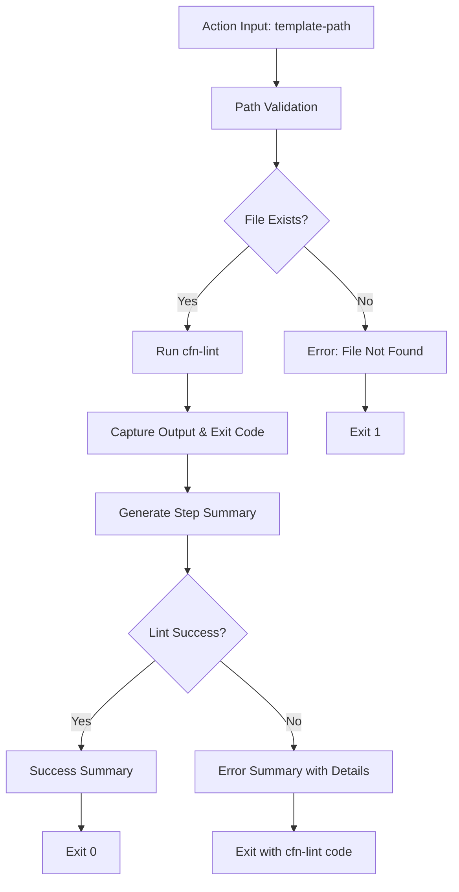

# Design Document

## Overview

The CloudFormation Linter Action is a GitHub reusable composite action that provides standardized CloudFormation template validation using cfn-lint. The action accepts a template path as input, validates the file existence, runs cfn-lint with proper error handling, and generates comprehensive GitHub Step Summary reports. This design leverages GitHub's composite action architecture to create a reusable, maintainable solution that can be consumed across multiple repositories.

## Architecture

The action follows GitHub's composite action pattern, defined in `action.yaml` with shell-based execution steps. The architecture consists of:

1. **Input Layer**: Accepts and validates the `template-path` parameter
2. **Validation Layer**: Verifies file existence and constructs proper paths
3. **Execution Layer**: Runs cfn-lint with controlled error handling
4. **Reporting Layer**: Generates GitHub Step Summary with formatted results
5. **Exit Handling Layer**: Preserves cfn-lint exit codes for workflow decision making



## Components and Interfaces

### Action Metadata (action.yaml)
- **Name**: "CloudFormation Linter"
- **Description**: "Run cfn-lint on CloudFormation templates with comprehensive reporting"
- **Inputs**:
  - `template-path`: Required string input specifying the relative path to the CloudFormation template
- **Runs**: Composite action using bash shell steps

### Core Components

#### 1. Input Validation Component
- **Purpose**: Validate and process the template-path input
- **Interface**: Receives `template-path` from action inputs
- **Behavior**: 
  - Constructs full path using `${{ github.workspace }}`
  - Extracts template name using `basename`
  - Validates file existence

#### 2. cfn-lint Execution Component  
- **Purpose**: Execute CloudFormation linting with proper error handling
- **Interface**: Takes validated file path, returns output and exit code
- **Behavior**:
  - Runs cfn-lint with `--format parseable` for consistent output
  - Uses `set +e` / `set -e` pattern to capture exit codes without premature termination
  - Captures both stdout and stderr in `LINT_OUTPUT` variable

#### 3. GitHub Step Summary Component
- **Purpose**: Generate formatted reports for GitHub UI
- **Interface**: Takes lint results and exit code, writes to `$GITHUB_STEP_SUMMARY`
- **Behavior**:
  - Creates markdown-formatted summary with template name
  - Includes success/failure status with appropriate emojis
  - Formats lint output in code blocks for readability
  - Provides exit code documentation for user reference

#### 4. Exit Code Handler Component
- **Purpose**: Preserve cfn-lint exit codes for workflow decision making
- **Interface**: Takes cfn-lint exit code, determines final action exit
- **Behavior**:
  - Maps cfn-lint exit codes to action behavior
  - Provides clear exit code documentation (0: No issues, 2: Warnings, 4: Errors, 8: Invalid CLI, 16: Fatal errors)
  - Ensures workflow can make informed decisions based on linting severity

## Data Models

### Input Model
```yaml
template-path:
  type: string
  required: true
  description: "Relative path to CloudFormation template from repository root"
  example: "infrastructure/template.yaml"
```

### Internal Data Flow
```bash
# Path Processing
TEMPLATE_PATH="${{ inputs.template-path }}"
TEMPLATE_NAME=$(basename "$TEMPLATE_PATH")
FULL_TEMPLATE_PATH="${{ github.workspace }}/$TEMPLATE_PATH"

# Execution Results
LINT_OUTPUT: string  # Combined stdout/stderr from cfn-lint
LINT_EXIT_CODE: integer  # cfn-lint process exit code

# Exit Code Mappings
0: No issues found
2: Warnings detected
4: Errors detected  
8: Invalid CLI arguments
16: Fatal errors occurred
```

## Error Handling

### File Not Found Error
- **Trigger**: Template file doesn't exist at specified path
- **Response**: Display error message with full path, exit with code 1
- **User Experience**: Clear indication of path resolution issue

### cfn-lint Execution Errors
- **Trigger**: cfn-lint tool fails to execute or encounters fatal errors
- **Response**: Capture all output, preserve original exit code, display in summary
- **User Experience**: Full visibility into linting tool behavior

### Path Resolution Errors
- **Trigger**: Invalid characters or path traversal attempts in template-path
- **Response**: Bash path resolution will handle naturally, file existence check will catch issues
- **User Experience**: Clear error messaging through file existence validation

## Testing Strategy

### Unit Testing Approach
Since this is a composite GitHub action, testing will focus on:

1. **Action Metadata Validation**
   - Verify action.yaml syntax and structure
   - Validate input definitions and requirements
   - Test action discoverability and metadata completeness

2. **Shell Script Logic Testing**
   - Test path construction and validation logic
   - Verify error handling for missing files
   - Test cfn-lint command construction and execution
   - Validate output capture and processing

3. **Integration Testing**
   - Test with valid CloudFormation templates (should pass)
   - Test with invalid CloudFormation templates (should fail with appropriate codes)
   - Test with missing template files (should exit with code 1)
   - Test GitHub Step Summary generation

### Test Scenarios

#### Success Path Testing
- Valid template path with clean CloudFormation template
- Verify success summary generation
- Confirm exit code 0

#### Error Path Testing  
- Invalid template path (file not found)
- CloudFormation template with syntax errors
- CloudFormation template with warnings
- Invalid cfn-lint CLI usage

#### Edge Case Testing
- Template paths with spaces or special characters
- Very large CloudFormation templates
- Templates in nested directory structures
- Empty or zero-byte template files

### Continuous Integration Testing
- Use GitHub Actions workflow to test the action itself
- Test against multiple CloudFormation template scenarios
- Verify cross-platform compatibility (ubuntu-latest, windows-latest, macos-latest)
- Test with different versions of cfn-lint

## Implementation Notes

### Dependencies
- **cfn-lint**: Must be available in the runner environment (will be installed via pip)
- **Python**: Required for cfn-lint (will use actions/setup-python@v5)
- **Bash**: For shell script execution (available in all GitHub runners)

### Performance Considerations
- cfn-lint execution time scales with template complexity
- Large templates may require extended timeout considerations
- Output capture should handle large lint result sets

### Security Considerations
- Input validation prevents path traversal attacks
- No sensitive data exposure in step summaries
- Proper shell escaping for file paths and names
- No external network calls beyond cfn-lint execution